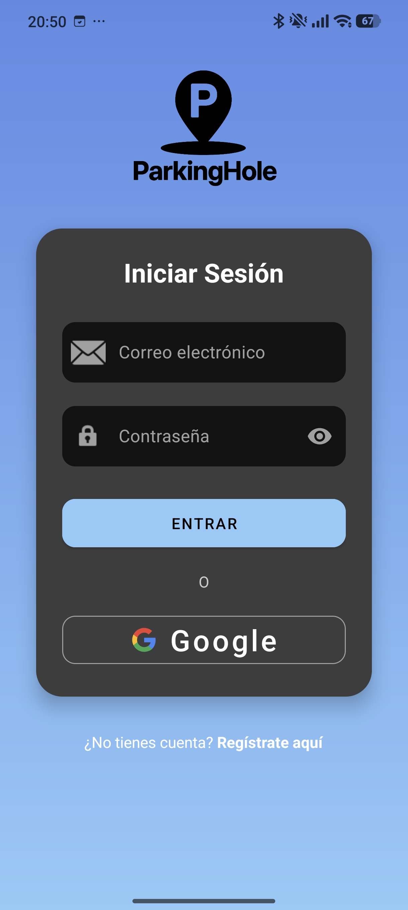
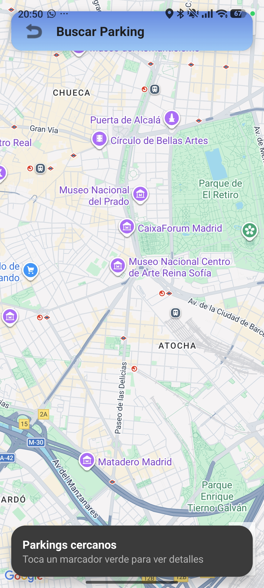
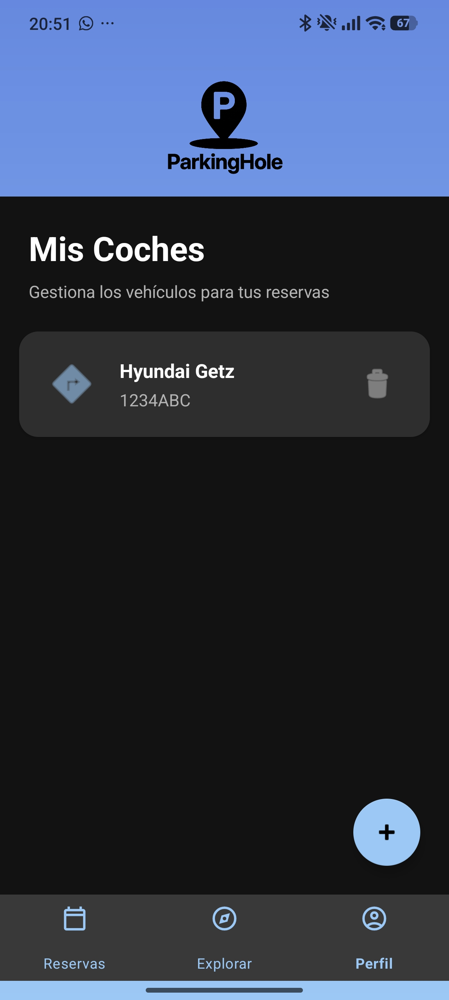

<div align="center">

# 🚗 ParkingHole
**El ecosistema inteligente para el intercambio de plazas de aparcamiento.**

[](https://www.android.com/)
[](https://kotlinlang.org/)
[](https://spring.io/projects/spring-boot)
[](https://dev.java/)
[](https://www.postgresql.org/)
[](https://stripe.com/)

</div>

---

## 🎯 El Problema y La Solución

> *"En las grandes ciudades, los conductores pasan un promedio de 20 minutos interminables dando vueltas hasta encontrar un hueco libre en la calle, generando frustración, pérdida de tiempo y emisiones innecesarias de CO2."*

**ParkingHole** nace para transformar esta agonía en una oportunidad colaborativa y rentable. Conectamos en tiempo real a los conductores que están a punto de liberar su plaza de aparcamiento en la vía pública con aquellos que la necesitan desesperadamente. 
**Tiempo ahorrado, menos contaminación y recompensas directas para la comunidad.**

---

## ✨ Características Principales

- **🔐 Autenticación Segura**: Integración fluida y rápida con Google Sign-In mediante Firebase Auth.
- **🗺️ Mapa Interactivo en Tiempo Real**: Visualización de plazas disponibles y geolocalización precisa usando Google Maps SDK.
- **💳 Pagos y Recompensas**: Infraestructura robusta y segura respaldada por Stripe Connect. Premia a quienes ceden su hueco y asegura la transacción de quienes lo compran.
- **🚗 Gestión Integral de Vehículos**: Almacena y administra múltiples coches en tu garaje digital para un intercambio ágil.
- **📱 Interfaz Moderna y Adaptable**: Diseño cuidado basado en Material Design, soporte completo para **Modo Oscuro** y layouts responsivos.

---

## 🛠️ Stack Tecnológico

La plataforma está diseñada como un sistema multicapa distribuido:

### 📱 Frontend (App Móvil)
- **Lenguaje**: Kotlin (API 24 - 36)
- **Arquitectura**: UI ViewBinding, Fragments + BottomSheets
- **Comunicaciones y Mapas**: Retrofit2 (REST), Gson, Google Maps SDK, Location Services

### ⚙️ Backend (API REST)
- **Framework**: Spring Boot 4.0.2
- **Lenguaje**: Java 17
- **Mapeo / ORM**: Spring Data JPA, Hibernate
- **Utilidades**: Lombok, Stripe Java SDK

### 🗄️ Base de Datos
- **Motor**: PostgreSQL Relacional
- **Lógica Interna**: Triggers automáticos y geolocación espacial para la búsqueda eficiente de transacciones (`Esperando`).

---

## 📁 Arquitectura del Monorepo

Este repositorio centraliza todo el código de ParkingHole, facilitando la sincronización de esquemas y modelos de datos entre cliente y servidor:

*   `/TFG_app`: Contiene todo el código fuente del cliente Android nativo.
*   `/Api_ParkingHole`: Contiene el proyecto Maven de Spring Boot encargado de la lógica de negocio, endpoints y persistencia.
*   `/context` (Uso Interno AI): Contiene `AGENT.md` y `schema.sql` detallando las reglas operativas, el histórico de resolución de problemas e integraciones de bases de datos para agentes de inteligencia artificial colaboradores en el proyecto.

---

## 🚀 Cómo Empezar (Getting Started)

Sigue estos pasos para levantar el ecosistema ParkingHole en tu entorno local:

1. **Clona el repositorio**
   ```bash
   git clone https://github.com/AlexFreire0/TFG-Alex.git
   cd TFG-Alex
   ```

2. **Configura la Base de Datos**
   * Instala PostgreSQL y crea una base de datos llamada `parkinghole_db`.
   * El esquema completo está disponible en `/context/schema.sql`.

3. **Inicia el Backend (Spring Boot)**
   * Copia `Api_ParkingHole/src/main/resources/application.properties.example` a `application.properties` e introduce tus credenciales locales de la BD y Stripe.
   * Abre el proyecto `/Api_ParkingHole` en IntelliJ IDEA o ejecútalo vía Maven y levántalo en el puerto `8080`.

4. **Ejecuta el Frontend (Android)**
   * Abre `/TFG_app` en Android Studio.
   * Crea un archivo `local.properties` en la raíz de la app e inserta tu `MAPS_API_KEY`.
   * Configura tu propio proyecto de Firebase y añade tu archivo `google-services.json` dentro de `TFG_app/app`.
   * Sincroniza Gradle y lánzalo en tu emulador o dispositivo físico.

---

## 📱 Capturas de Pantalla (Screenshots)

<div align="center">
  <!-- Reemplaza los enlaces (src) con las rutas relativas de tus imágenes o GIFs -->
  
  
  
  
  
  <br/>
  <i>Demo de la aplicación: (Izquierda) Login fluido con Google, (Centro) Mapa inmersivo de búsqueda, (Derecha) Garaje de vehículos registrados.</i>
</div>

---

## 👨‍💻 Autoría y Licencia

**Trabajo de Fin de Grado (TFG)**
Desarrollado y diseñado íntegramente por **Alejandro Freire (AlexFreire0)**.

Este proyecto se realiza con fines académicos y comerciales. Todos los derechos sobre la propiedad intelectual, código fuente, diseño arquitectónico e imagen de marca de **ParkingHole** se encuentran reservados. 
Para verificar las atribuciones formales de autoría, consultar el archivo [`AUTHORSHIP_PROOF.md`](./AUTHORSHIP_PROOF.md) anexado a este repositorio.
